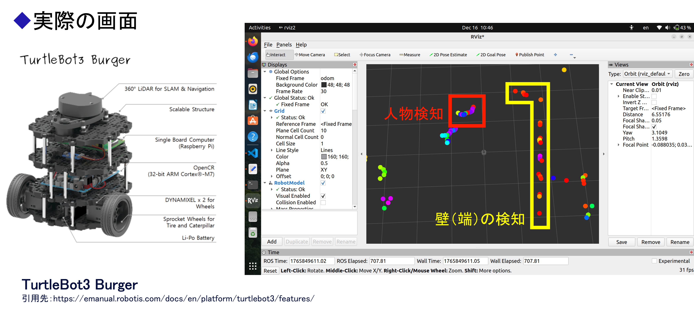

# おちまも Robot — Fall Prevention System for High-Altitude Worksites

A ROS 2 package running on **TurtleBot3 + Raspberry Pi 4** that detects workers in a camera feed, estimates their distance to nearby walls/fences using LiDAR, and publishes the results for visualization and downstream alerting.



---

## Background

Japan's Ministry of Health, Labour and Welfare reported 20,758 fall-related casualties in FY2023. Ochimamo addresses this by alerting workers when they approach dangerous zones. This repository implements the **TurtleBot3 distance-estimation subsystem** — one part of a larger system that also includes BLE-based trilateral positioning and a Tkinter safety-map app.

---

## How It Works

```
Camera image → YOLO26n (MNN) → worker bounding box → horizontal angle θ
LiDAR scan   → Hough transform (first scan) → wall segments
θ + LiDAR    → worker distance from robot
worker pos   → nearest wall segment (vector projection) → wall distance
             → TF2 transform (LiDAR frame → odom) → RViz markers
```

### `PeopleMapperNode` (main ROS 2 node)

Subscribes to the camera and LiDAR, fuses the two streams on every image frame:

1. Rotates the incoming image 90° CCW (camera is mounted sideways).
2. Runs **YOLO26n** inference via MNN to detect people, then an **IoU tracker** to assign consistent per-frame IDs.
3. Runs **ArUco marker detection** (DICT\_4X4\_50) to bind a stable worker ID to each YOLO bounding box.
4. Converts each detected worker's bounding-box centre to a horizontal angle θ using camera intrinsics (`fx`, `cx` from `/camera/camera_info`).
5. Queries the LiDAR system for the nearest valid range within a ±0.02 rad cone around θ + `camera_lidar_yaw`.
6. Computes the worker's shortest distance to any wall segment.
7. Transforms the worker's (x, y) position from the LiDAR frame to `odom` via TF2, then publishes a sphere marker.

A 100 ms timer also re-publishes the detected wall lines at a steady rate.

### `LidarSystemHough` (LiDAR subsystem)

Wall calibration runs **once on the first LaserScan**:

- Projects scan points onto a 20 m × 20 m occupancy grid (1000 × 1000 px, 2 cm/px).
- Dilates the grid with a 3 × 3 kernel to connect nearby points.
- Runs **Probabilistic Hough Line Transform** (min line 1.5 m, max gap 0.5 m) to extract wall segments.
- Saves a debug image to `/home/ubuntu/lidar_hough.png`.

After calibration:
- `getDistanceAtAngle()` — returns the nearest valid LiDAR range in a small angular cone.
- `getMinDistanceToSur()` — projects the worker's Cartesian position onto every wall segment and returns the shortest distance plus both endpoints (used to draw the arrow marker).

### `VisionSystem` (vision subsystem)

- Loads a **YOLO26n `.mnn`** weights file via the MNN inference framework (4 CPU threads).
- Letterbox-resizes input to 640 × 640, converts BGR → RGB → float32/255, copies into CHW layout for MNN.
- Decodes YOLOv8-format output `[1, 84, 8400]`, keeps only class 0 (person), applies **OpenCV NMS**.
- **Simple IoU tracker**: greedy matching (IoU threshold 0.3), tracks expire after 30 frames.
- **ArUco association**: marker centre is checked against each person bounding box; the ArUco ID overrides the YOLO track ID for stable worker identification across frame gaps.

---

## ROS 2 Interface

### Subscribed Topics

| Topic | Type | Description |
|---|---|---|
| `/scan` | `sensor_msgs/LaserScan` | 360° LiDAR scan |
| `/camera/camera_info` | `sensor_msgs/CameraInfo` | Camera intrinsics |
| `/camera/image_raw` | `sensor_msgs/Image` | Raw camera frames |

### Published Topics

| Topic | Type | Description |
|---|---|---|
| `/people_markers` | `visualization_msgs/MarkerArray` | Red spheres at detected worker positions (odom frame, 0.5 s lifetime) |
| `/wall_markers` | `visualization_msgs/MarkerArray` | Green wall segments from Hough transform (LiDAR frame) |
| `/people/wall_distance` | `std_msgs/String` | `"track_id:distance_m"` for each detected worker |
| `distance_vector` | `visualization_msgs/Marker` | Cyan arrow from worker to nearest wall (0.2 s lifetime) |
| `/people_mapper/debug_image` | `sensor_msgs/Image` | Annotated frame with YOLO boxes and ArUco markers |

### Parameters

| Parameter | Default | Description |
|---|---|---|
| `camera_lidar_yaw` | `π/2 − 0.07π` | Angular offset between camera optical axis and LiDAR zero-angle. Add `π` if camera faces backward. |
| `target_frame` | `"odom"` | TF frame for the published person markers |

---

## Dependencies

- **ROS 2** (tested on Raspberry Pi 4 with Ubuntu)
- `rclcpp`, `sensor_msgs`, `geometry_msgs`, `visualization_msgs`, `std_msgs`
- `tf2_ros`, `tf2_geometry_msgs`
- `cv_bridge`, `image_transport`
- **OpenCV** (with ArUco module)
- **MNN** (Alibaba inference framework — must be installed separately)
- YOLO26n weights in `.mnn` format placed at the working directory as `yolo26n.mnn`

---

## Build & Run

All commands run on the Raspberry Pi. Remote editing via VS Code SSH is recommended.

```bash
# Inside ~/yolo_lidar/src/ — build the package
colcon build
source install/setup.bash
```

Start each of the following in a separate terminal:

```bash
# 1. TurtleBot3 hardware drivers
ros2 launch turtlebot3_bringup robot.launch.py

# 2. Camera node (320×240 for Raspberry Pi 4 performance)
ros2 run camera_ros camera_node --ros-args -p format:='RGB888' -p width:=320 -p height:=240

# 3. People mapper node (run from home directory)
cd ~
ros2 run yolo_lidar people_mapper_node
```

---

## Visualization (RViz2)

Run on a machine connected to the same network as the Raspberry Pi:

```bash
ros2 run rviz2 rviz2
```

Recommended RViz setup:
- **Fixed Frame**: `odom`
- Add **LaserScan** → `/scan` (surrounding environment)
- Add **MarkerArray** → `/people_markers` (red spheres = detected workers)
- Add **MarkerArray** → `/wall_markers` (green lines = Hough-detected walls)
- Add **Marker** → `distance_vector` (cyan arrow = worker-to-wall vector)
- Add **Image** → `/people_mapper/debug_image` (annotated camera view)

---

## Design Decisions & Known Limitations

| Topic | Detail |
|---|---|
| **Wall calibration** | Runs once on the first LiDAR scan and is never updated. Assumes static walls. |
| **2D only** | Uses a 2D LiDAR, so the system cannot detect vertical fall risks (e.g., open edges above or below the scan plane). |
| **Model** | Switched from YOLO11n to **YOLO26n** (NMS-free architecture) after the Dec 2025 fieldwork to reduce Raspberry Pi processing load. Inference runs every 3rd frame. |
| **Worker ID** | YOLO tracking IDs reset when a worker leaves the frame. ArUco markers (worn by workers) provide stable IDs that survive detection gaps. |
| **BLE alerting** | An earlier GATT-based alert node had resource-leak issues on reconnect. The replacement design uses **BLE Manufacturer Data broadcast** (8 bits → up to 8 workers), so M5Stack wearables receive alerts without pairing. Integration with the BLE trilateral positioning subsystem is not yet complete. |
| **Angle offset** | `camera_lidar_yaw` must be calibrated per robot/mounting. The default assumes the camera faces 90° − 7% of π from the LiDAR zero-angle. |

---

## Project Structure

```
yolo_lidar/
├── include/yolo_lidar/
│   ├── people_mapper_node.hpp   # ROS 2 node declaration
│   ├── lidar_system.hpp         # LidarSystemHough class
│   └── vision_system.hpp        # VisionSystem class (YOLO + ArUco + tracker)
├── src/
│   ├── main.cpp                 # Entry point
│   ├── people_mapper_node.cpp   # Node implementation (sensor fusion logic)
│   ├── lidar_system.cpp         # Hough wall detection & distance queries
│   └── vision_system.cpp        # MNN inference, ArUco, IoU tracker
├── CMakeLists.txt
└── package.xml
```

---

## Recommendations for Future Work

### 1. Integrate the BLE subsystem end-to-end
The M5Stack trilateral-positioning subsystem and the BLE Manufacturer Data broadcast alert node have not been connected to this distance-estimation node yet. The missing link is subscribing to `/people/wall_distance` in the broadcast node and encoding the danger state into the 8-bit Manufacturer Data payload, so the full pipeline runs without manual intervention: worker detected → distance computed → M5Stack wearable vibrates/beeps.

### 2. Upgrade to a 3D LiDAR or RGBD camera
The current 2D LiDAR scans only a single horizontal plane at robot height. It cannot see open edges or drops above/below that plane — the most critical risk at a real high-altitude worksite. A 3D LiDAR (e.g., Velodyne VLP-16) or a depth camera (e.g., Intel RealSense) would allow the system to detect the floor edge and warn workers approaching a vertical drop.

### 3. Add dynamic wall re-calibration
`calibrateWalls()` runs once on the first scan and the result is never updated. If the robot repositions during a shift, or scaffolding is rearranged, the stored wall segments become wrong. Exposing a ROS 2 service (e.g., `~/recalibrate_walls`) that re-runs the Hough detection on demand would handle this without restarting the node.

### 4. Auto-calibrate `camera_lidar_yaw`
The angular offset between the camera optical axis and the LiDAR zero-angle is hardcoded. A one-time calibration routine — e.g., place a reflective target at a known position, detect it in both the camera image and the LiDAR scan, then solve for the angular offset — would remove the per-mounting manual tuning and reduce a common source of distance error.

### 5. Validate with quantitative metrics at a real worksite
The December 2025 fieldwork was qualitative only (school building, indoors). Before deployment, measure at an actual high-altitude site:
- **Distance error**: estimated vs. tape-measured worker-to-wall distance at several angles and distances.
- **Detection rate / false-negative rate** at the edges of the camera field of view and in poor lighting.
- **End-to-end latency**: from a worker crossing the danger threshold to the M5Stack alert firing.

### 6. Layer in complementary safety measures
The report recommends that this system should not be the sole safety measure. Practical additions to implement alongside it:
- **Pre-shift check**: use the camera to verify the worker is wearing a harness and helmet before the shift starts.
- **Fall/tilt detection**: an IMU worn by the worker can detect a sudden fall even if the robot camera cannot see them.
- **Worker panic button**: a manual alert trigger on the M5Stack as a backup when the robot has no line of sight.
- **Alert logging**: record each alert with timestamp, worker ID (ArUco), and estimated distance to wall, so incident reports can be reconstructed.

### 7. Hardware certification and weatherproofing
The M5Stack devices require Japanese radio equipment certification (技適) before legal use on a real worksite. The TurtleBot3 and Raspberry Pi 4 also need weatherproofing (rain, dust, wind) for outdoor high-altitude use. These are non-negotiable prerequisites before any real-world deployment.
